# News App


[](LICENSE)
[](https://flutter.dev/)
[](https://github.com/rrifafauzikomara/MovieCatalogue)


## Features
* Headline
* Detail News
* Dynamic Behavior (Cupertino for iOS, Material for Android)
* Dynamic Theme (Light and Dark)
* Localization (Indonesian and English)


## 📸 Example iOS
<pre>
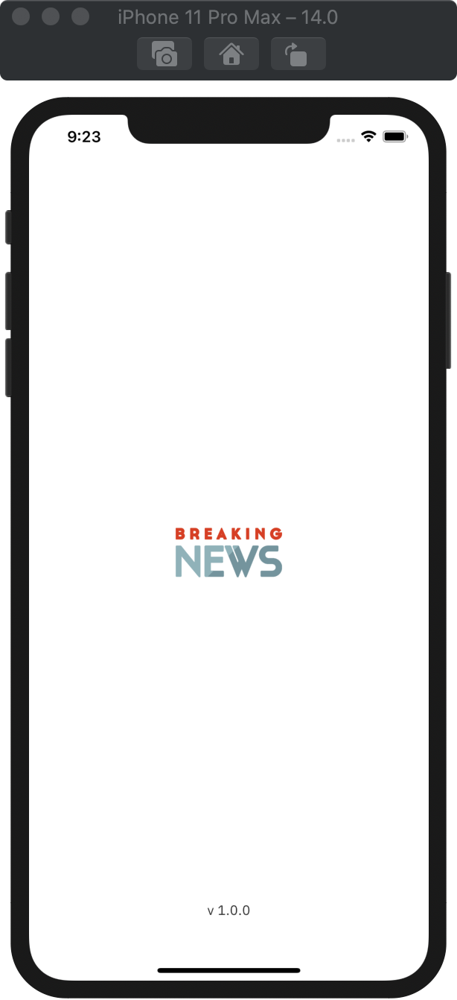     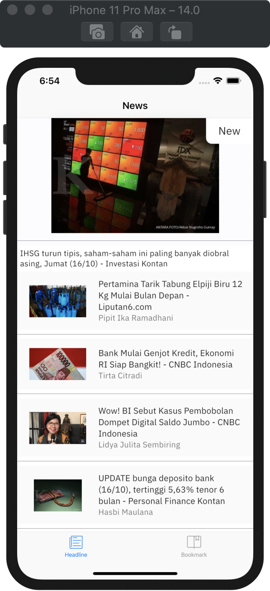     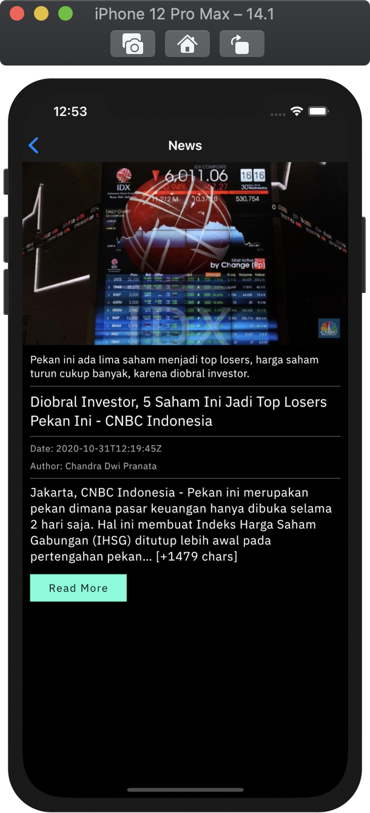     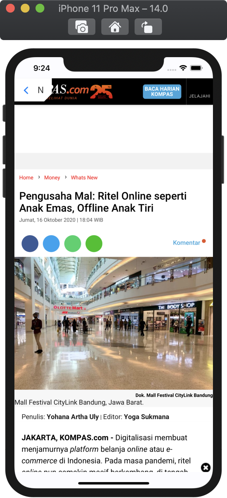     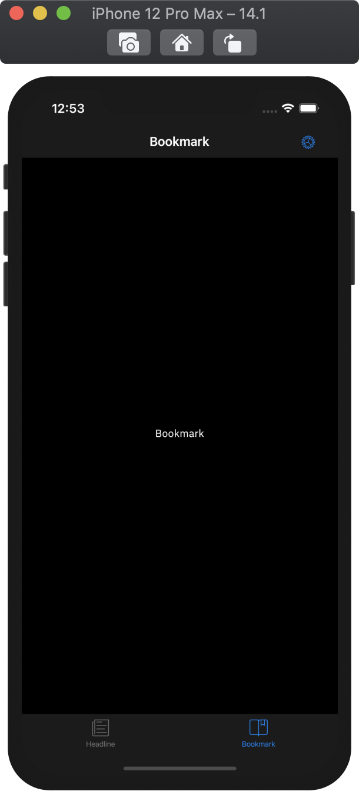     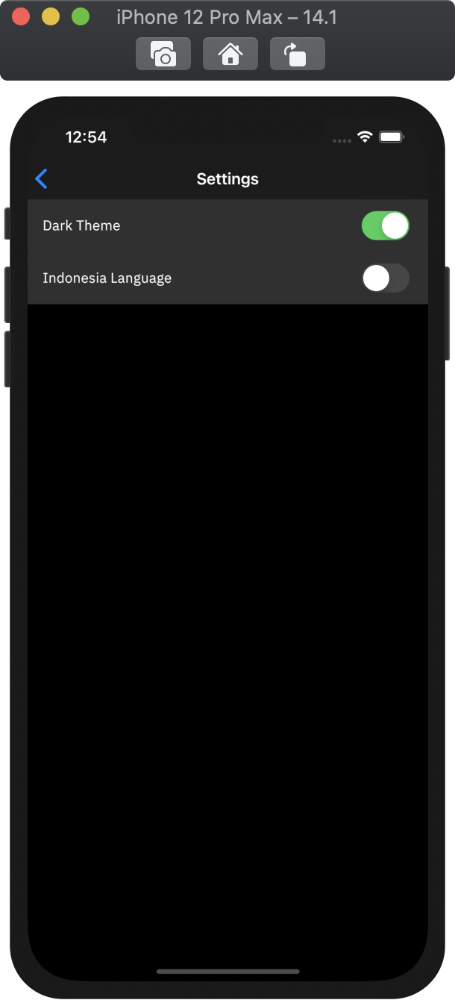
</pre>


## 📸 Example Android
<pre>
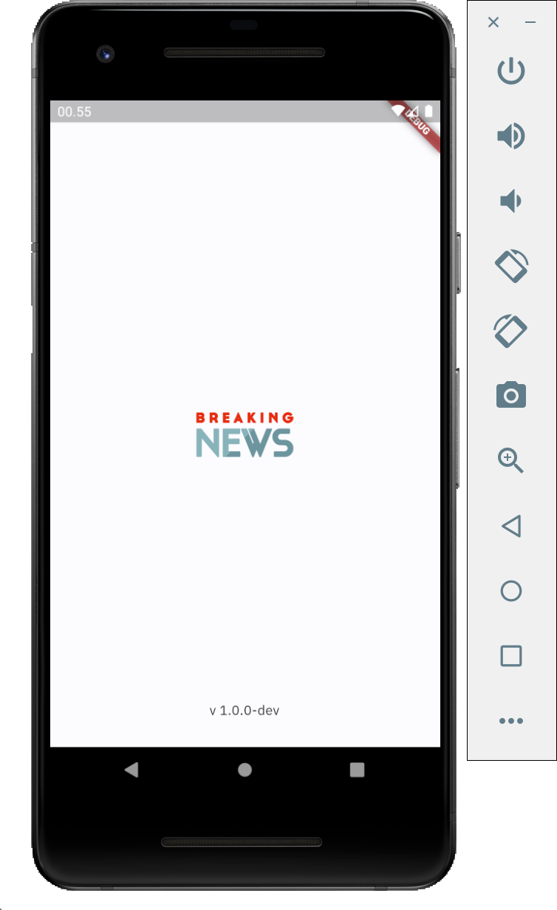     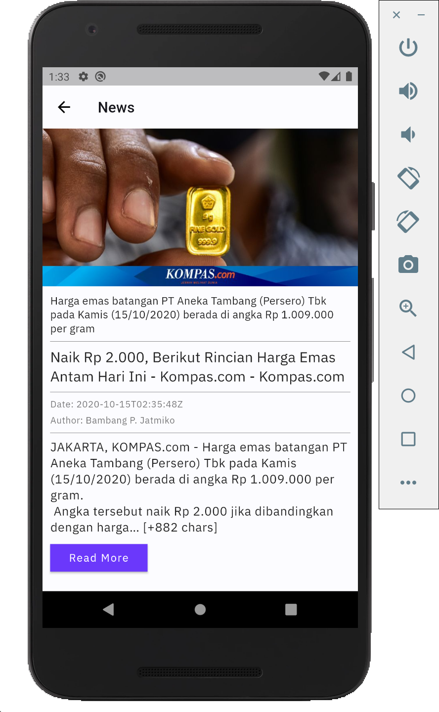     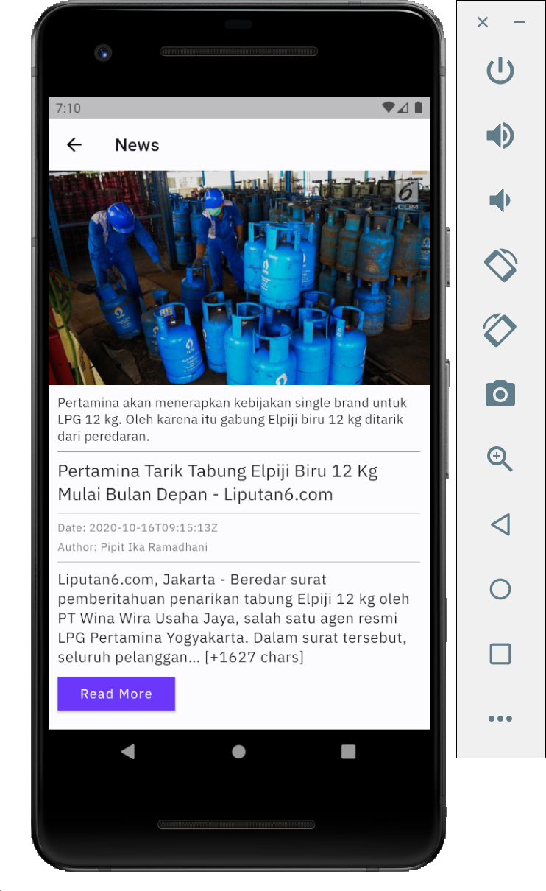     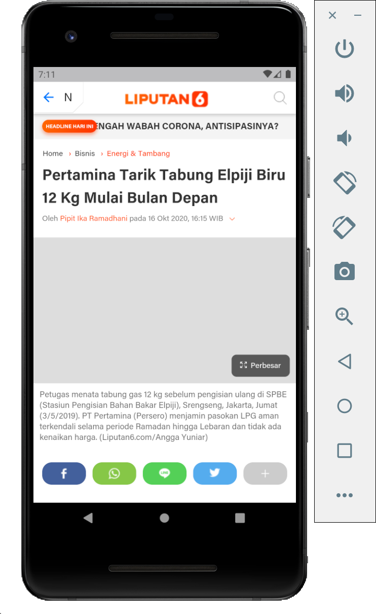     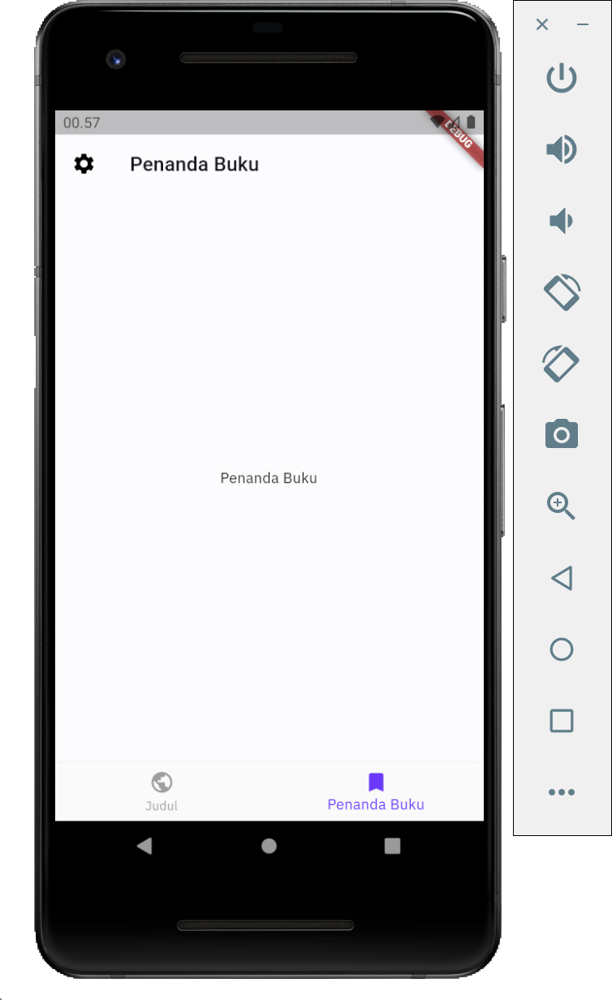     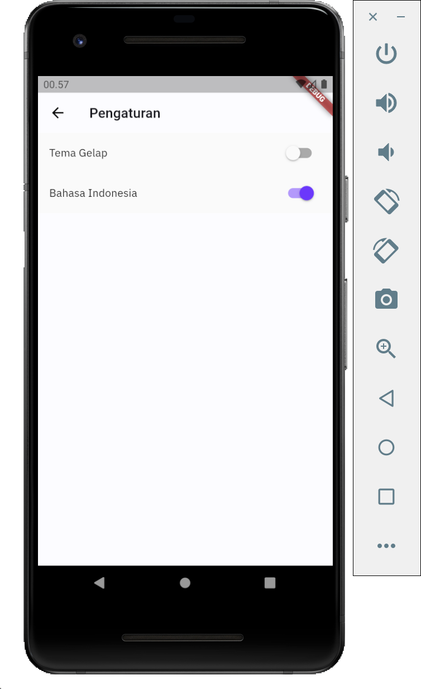
</pre>


## Quick start
This is a normal flutter app. You should follow the instructions in the [official documentation](https://flutter.io/docs/get-started/install).
This project uses **BLoC** (business logic component) to separate the business logic with UI itself and uses **Modularization** approach to separate each modules.
It's recommended to do self-study about it in here (BLoC: [here](https://bloclibrary.dev/), Modularization: [here](https://medium.com/flutter-community/mastering-flutter-modularization-in-several-ways-f5bced19101a) and [here](https://pub.dev/packages/flutter_modular)).


## Modularization Structure 🔥

    # Root Project
    .
    ├── features               # Name of directory
    |   ├── feature A          # Feature module with a clean architecture inside it.
    |   ├── feature B
    |   └── feature etc
    |
    ├── lib                    # Name of module (default from Flutter)
    |
    └── libraries              # Name of directory
        ├── core               # Core module.
        ├── dependencies       # Handle dependency version updates.
        └── shared             # Handle common utility class and custom widget.


## Clean Architecture Flow (Feature Module) 🔥
<pre>
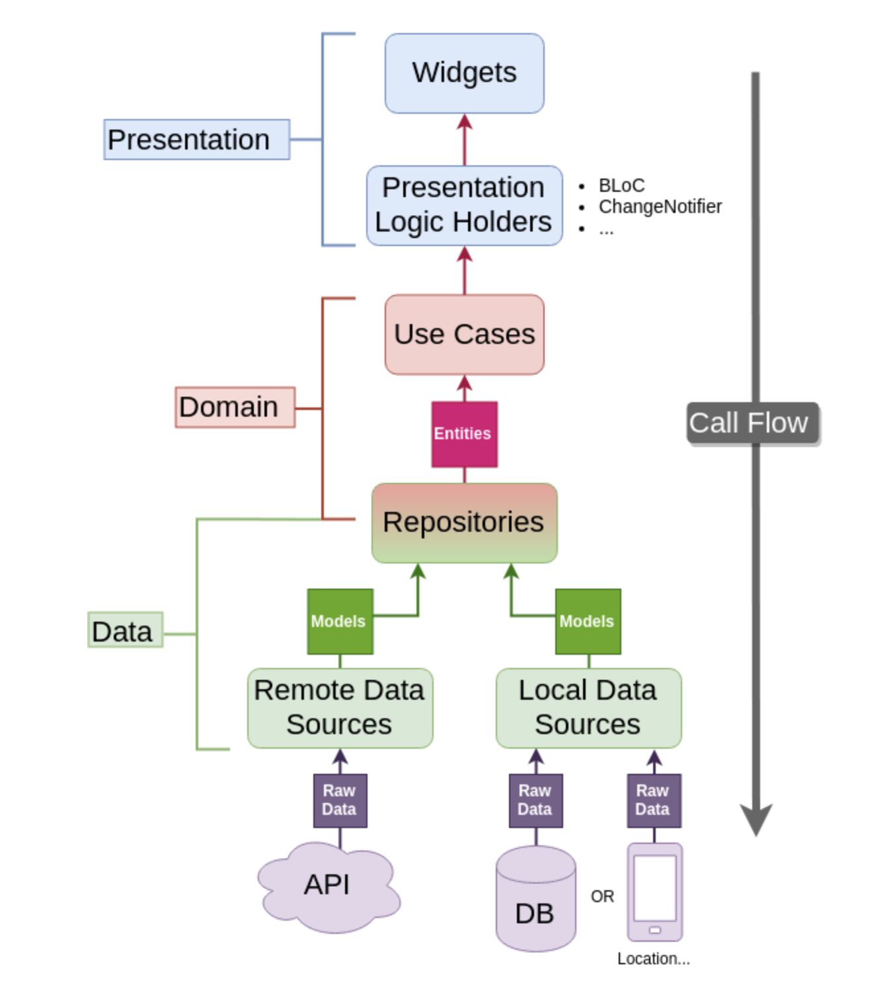
</pre>


## Built With 🛠
* [Modularization](https://medium.com/flutter-community/mastering-flutter-modularization-in-several-ways-f5bced19101a) with [flutter_modular](https://pub.dev/packages/flutter_modular) packages  - Separate functionality into independent, interchangeable modules.
* [Equatable](https://pub.dev/packages/equatable) - Being able to compare objects in `Dart` often involves having to override the `==` operator.
* [Json Serializable](https://pub.dev/packages/json_serializable) - Builders for handling JSON.
* [Dio](https://github.com/flutterchina/dio/) - A type-safe HTTP client.
* [BLoC Pattern](https://bloclibrary.dev/) - Business logic component to separate the business logic with UI.
* State - (Loading, No Data, Has Data, No Internet Connection, Request Timeout, Error)
* [Flutter Screenutil](https://pub.dev/packages/flutter_screenutil) - Responsive UI.
* [Flavor](https://medium.com/@animeshjain/build-flavors-in-flutter-android-and-ios-with-different-firebase-projects-per-flavor-27c5c5dac10b) - Handling different environments for development and production.
* [Localization](https://pub.dev/packages/easy_localization) - Easy to change language between English and Indonesian.


## Todo
* [ ] Favorite News using Moor
* [ ] Unit Testing
* [ ] Integration Testing
* [ ] Code Coverage
* [ ] CI/CD
* [ ] Publish to Play Store


## How to run the App
1. Clone this project.
2. Open with your favorite tools editor.
3. Run `Pub get` on each module sequentially starting from `dependencies` and ends `your root project` to generated `pubspec.lock` file.
4. Generated `*.g.dart` file in `list_news` module. But before you running that, make sure go to [list_news](https://github.com/rrifafauzikomara/NewsApp/tree/master/features/list_news) module first using `cd` command. For example `cd features` and then `cd list_news`. Then you can run this command: `flutter packages pub run build_runner build --delete-conflicting-outputs`.
5. Run the App using [this](https://github.com/rrifafauzikomara/NewsApp#run-the-app-using-command-prompt) or [this](https://github.com/rrifafauzikomara/NewsApp#run-the-app-using-green-button). Enjoy your App!.


## Run the App using command prompt
Development
```console
flutter run --flavor development --target=lib/ui/launcher/main-dev.dart
```
Production
```console
flutter run --flavor production --target=lib/ui/launcher/main-prod.dart
```


## Run the App using green button
Just follow this [instruction](https://github.com/rrifafauzikomara/MovieApp#run-the-app-using-).


## Author

* **R Rifa Fauzi Komara**

Don't forget to follow me, fork and give me a ⭐


## License

```
MIT License

Copyright (c) [2020] [R Rifa Fauzi Komara]

Permission is hereby granted, free of charge, to any person obtaining a copy
of this software and associated documentation files (the "Software"), to deal
in the Software without restriction, including without limitation the rights
to use, copy, modify, merge, publish, distribute, sublicense, and/or sell
copies of the Software, and to permit persons to whom the Software is
furnished to do so, subject to the following conditions:

The above copyright notice and this permission notice shall be included in all
copies or substantial portions of the Software.

THE SOFTWARE IS PROVIDED "AS IS", WITHOUT WARRANTY OF ANY KIND, EXPRESS OR
IMPLIED, INCLUDING BUT NOT LIMITED TO THE WARRANTIES OF MERCHANTABILITY,
FITNESS FOR A PARTICULAR PURPOSE AND NONINFRINGEMENT. IN NO EVENT SHALL THE
AUTHORS OR COPYRIGHT HOLDERS BE LIABLE FOR ANY CLAIM, DAMAGES OR OTHER
LIABILITY, WHETHER IN AN ACTION OF CONTRACT, TORT OR OTHERWISE, ARISING FROM,
OUT OF OR IN CONNECTION WITH THE SOFTWARE OR THE USE OR OTHER DEALINGS IN THE
SOFTWARE.
```